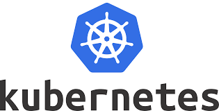

# Consolidating containerized apps with Azure Kubernetes Service

## Contenido
<!-- TOC -->
- [Consolidating containerized apps with Azure Kubernetes Service](#consolidating-containerized-apps-with-azure-kubernetes-service)
  - [Contenido](#contenido)
  - [Introducción](#introducci%c3%b3n)
  - [Conceptos](#conceptos)
    - [Kubernetes](#kubernetes)
  - [Pre requisitos](#pre-requisitos)
    - [Tarea 1: Iniciar sesión en Azure](#tarea-1-iniciar-sesi%c3%b3n-en-azure)
    - [Tarea 2: Definir las variables necesarias](#tarea-2-definir-las-variables-necesarias)
    - [Tarea 3: Desplegar los recursos necesarios](#tarea-3-desplegar-los-recursos-necesarios)
  - [Despliegue de AKS](#despliegue-de-aks)
    - [Tarea 1: Acceder a las versiones disponibles](#tarea-1-acceder-a-las-versiones-disponibles)
    - [Tarea 2: Despliegue del cluster de AKS](#tarea-2-despliegue-del-cluster-de-aks)
    - [Tarea 3: Configuación de Kubectl](#tarea-3-configuaci%c3%b3n-de-kubectl)
  - [Implementación de MongoDB](#implementaci%c3%b3n-de-mongodb)
    - [Tarea 1: Helm:](#tarea-1-helm)
    - [Tarea 2: Implementar una instancia de MongoDB en el cluster](#tarea-2-implementar-una-instancia-de-mongodb-en-el-cluster)
    - [Tarea 3: Crear un Kubernetes secret para guardar los detalles de MongoDB](#tarea-3-crear-un-kubernetes-secret-para-guardar-los-detalles-de-mongodb)
  - [Deploy de la API Order Capture](#deploy-de-la-api-order-capture)
    - [Tarea 1:](#tarea-1)
    - [Tarea 2: Exponer la implementación `captureorder` como servicio](#tarea-2-exponer-la-implementaci%c3%b3n-captureorder-como-servicio)
    - [Tarea 3: Asegurarse que las órdenes se escriben en la MongoDB](#tarea-3-asegurarse-que-las-%c3%b3rdenes-se-escriben-en-la-mongodb)
  - [Desplegar el Front End](#desplegar-el-front-end)
    - [Tarea 1: Deploy del Front End](#tarea-1-deploy-del-front-end)
    - [Tarea 2: Exponer el Front End con un hostname](#tarea-2-exponer-el-front-end-con-un-hostname)
    - [Tarea 3: Implementar el ingress controller con Helm](#tarea-3-implementar-el-ingress-controller-con-helm)
    - [Tarea 4: Ingress](#tarea-4-ingress)
<!-- /TOC -->


## Introducción

Este laboratorio pretende demostrar de forma práctica las bases para el despliegue de Azure Kubernetes Service, así como también la gestión de kuberntes y el despliegue de soluciones contenerizadas por medio de Helm.

## Conceptos

### Kubernetes




## Pre requisitos

En caso de no tener una suscripción a Azure, se deberá iniciar sesion en el siguiente enlace para acceder a un trial gratis: [Create your Azure free account today](https://azure.microsoft.com/en-us/free/)

### Tarea 1: Iniciar sesión en Azure

1.  Iniciar sesión en: <https://portal.azure.com>.
2.  Abrir cloud Shell.

### Tarea 2: Definir las variables necesarias

```
BASE=AKSvOpen
PRESENTER='Victor'
LOCATION=eastus
LOCATION2=westus2
SUB='vOpen Workshop'
RG='WorkshopAKS'
RG2='WorkshopAKS2'
ACR_NAME='vOpenACR'
AKV_NAME=$BASE-$PRESENTER-vlt
KUBERNETESVERSION=1.14.6
CLUSTER_NAME=AKSCluster
NODE_COUNT=3
```


### Tarea 3: Desplegar los recursos necesarios

1. Seleccionar la suscripción que vamos a utilizar para desplegar los recursos:
```
az account set --subscription ""
```
2. Verificar que la suscripción sea la correcta, revisando los grupos de recursos desplegados:
```
az group list -o table
```
3. Crear los grupos de recursos:
```
az group create --resource-group $RG --location $LOCATION
az group create --resource-group $RG2 --location $LOCATION2
```
4. Desplegar un Azure Container Registry
```
az acr create --resource-group $RG --name $ACR_NAME --sku Standard --location $LOCATION
az acr update -n $ACR_NAME --admin-enabled true
```
5. Definir el lugar donde se alojará la configuración de Kubernetes:
```
export KUBECONFIG=~/.kube/config
```
6. Desplegar un Azure Key Vault
```
az keyvault create --resource-group $RG --name $AKV_NAME
```

## Despliegue de AKS

### Tarea 1: Acceder a las versiones disponibles


1.Listar todas las versiones disponibles:
```
az aks get-versions -l $LOCATION -o table
```
2. Listar la última versión de Kubernetes:
```
az aks get-versions -l $LOCATION --query 'orchestrators[-1].orchestratorVersion' -o tsv

```


### Tarea 2: Despliegue del cluster de AKS

```
az aks create --resource-group $RG --name $CLUSTER_NAME --node-count $NODE_COUNT --kubernetes-version $KUBERNETESVERSION \
--enable-addons monitoring,http_application_routing --generate-ssh-keys
```

```
CLIENT_ID=$(az aks show --resource-group $RG --name $CLUSTER_NAME --query "servicePrincipalProfile.clientId" --output tsv)
```
```
# Get the ACR registry resource id
ACR_ID=$(az acr show --name $ACR_NAME --resource-group $RG --query "id" --output tsv)
```

```
# Create role assignment
az role assignment create --assignee $CLIENT_ID --role Reader --scope $ACR_ID
```

```
# Show http application routing zone
az aks show --resource-group $RG --name $CLUSTER_NAME --query addonProfiles.httpApplicationRouting.config.HTTPApplicationRoutingZoneName -o tsv
```

### Tarea 3: Configuación de Kubectl
1. Configurar credenciales:
```
az aks get-credentials --resource-group $RG --name $CLUSTER_NAME --file ~/.kube/config --overwrite-existing
```
2. Obtener nodos desde Kubectl:
```
kubectl get nodes
```

## Implementación de MongoDB

Para la implementación de la base de datos en MongoDB vamos a utilizar **Helm**. Helm (del término marítimo de timón) es una herramienta para gestionar aplicaciones de Kubernetes. Helm te ayuda a dominar Kubernetes usando *cartas de navegación*, que en inglés se conocen como **Helm Charts**.

La principal función de Helm es definir, instalar y actualizar aplicaciones complejas de Kubernetes. Helm es mantenido por la CNCF en colaboración con Microsoft, Google, Bitnami y la comunidad de Helm.

### Tarea 1: Helm:

1. Guardar el siguiente código como `helm-rbac.yaml`:
```
apiVersion: v1
kind: ServiceAccount
metadata:
  name: tiller
  namespace: kube-system
---
apiVersion: rbac.authorization.k8s.io/v1
kind: ClusterRoleBinding
metadata:
  name: tiller
roleRef:
  apiGroup: rbac.authorization.k8s.io
  kind: ClusterRole
  name: cluster-admin
subjects:
  - kind: ServiceAccount
    name: tiller
    namespace: kube-system
```
2. Realizar el despliegue ejecutando:
```
kubectl apply -f helm-rbac.yaml
```
3. Iniciar Tiller (omitir el parámetro --service-account si el cluster no está "RBAC enabled"). Setting --history-max on helm init is recommended as configmaps and other objects in helm history can grow large in number if not purged by max limit. Without a max history set the history is kept indefinitely, leaving a large number of records for helm and tiller to maintain.
```
helm init --history-max 200 --service-account tiller --node-selectors "beta.kubernetes.io/os=linux"
```

### Tarea 2: Implementar una instancia de MongoDB en el cluster

1. Ejecutar:
```
helm install stable/mongodb --name orders-mongo --set mongodbUsername=orders-user,mongodbPassword=orders-password,mongodbDatabase=akschallenge
```

### Tarea 3: Crear un Kubernetes secret para guardar los detalles de MongoDB

1. Ejecutar el siguiente comando:
```
kubectl create secret generic mongodb --from-literal=mongoHost="orders-mongo-mongodb.default.svc.cluster.local" \
--from-literal=mongoUser="orders-user" --from-literal=mongoPassword="orders-password"
```

## Deploy de la API Order Capture

En esta sección vamos a ver como desplegar una API desde la imagen `azch/captureorder`

### Tarea 1: 

1. Guardar el siguiente código como `captureorder-deployment.yaml`:
```
apiVersion: apps/v1
kind: Deployment
metadata:
  name: captureorder
spec:
  selector:
      matchLabels:
        app: captureorder
  replicas: 2
  template:
      metadata:
        labels:
            app: captureorder
      spec:
        containers:
        - name: captureorder
          image: azch/captureorder
          imagePullPolicy: Always
          readinessProbe:
            httpGet:
              port: 8080
              path: /healthz
          livenessProbe:
            httpGet:
              port: 8080
              path: /healthz
          resources:
            requests:
              memory: "128Mi"
              cpu: "100m"
            limits:
              memory: "256Mi"
              cpu: "500m"
          env:
          - name: MONGOHOST
            valueFrom:
              secretKeyRef:
                name: mongodb
                key: mongoHost
          - name: MONGOUSER
            valueFrom:
              secretKeyRef:
                name: mongodb
                key: mongoUser
          - name: MONGOPASSWORD
            valueFrom:
              secretKeyRef:
                name: mongodb
                key: mongoPassword
          ports:
          - containerPort: 8080
```
2. Ejecutar el siguiente comando para realizar el despliegue:
```
kubectl apply -f captureorder-deployment.yaml
```
3. Verificar que los pods están up y ejecutándose:
```
kubectl get pods -l app=captureorder -w

```

### Tarea 2: Exponer la implementación `captureorder` como servicio

1. El siguiente bloque de código debe guardarse bajo el nombre de ``:
```
apiVersion: v1
kind: Service
metadata:
  name: captureorder
spec:
  selector:
    app: captureorder
  ports:
  - protocol: TCP
    port: 80
    targetPort: 8080
  type: LoadBalancer
```
2. Aplicar la configuración anterior por medio del siguiente comando:
```
kubectl apply -f captureorder-service.yaml
```
3. Obtener la IP externa del servicio (puede demorar unos minutos):
```
kubectl get service captureorder -o jsonpath="{.status.loadBalancer.ingress[*].ip}" -w
```

### Tarea 3: Asegurarse que las órdenes se escriben en la MongoDB

1. Ejecutar el siguiente comando para realizar la comprobación:
```
curl -d '{"EmailAddress": "email@domain.com", "Product": "prod-1", "Total": 100}' \
-H "Content-Type: application/json" -X POST http://[Your Service Public LoadBalancer IP]/v1/order
```


## Desplegar el Front End

### Tarea 1: Deploy del Front End

1. Generar el archivo `` para poder realizar el despliegue del Front end:
```
apiVersion: apps/v1
kind: Deployment
metadata:
  name: frontend
spec:
  selector:
      matchLabels:
        app: frontend
  replicas: 1
  template:
      metadata:
        labels:
            app: frontend
      spec:
        containers:
        - name: frontend
          image: azch/frontend
          imagePullPolicy: Always
          readinessProbe:
            httpGet:
              port: 8080
              path: /
          livenessProbe:
            httpGet:
              port: 8080
              path: /
          resources:
            requests:
              memory: "128Mi"
              cpu: "100m"
            limits:
              memory: "256Mi"
              cpu: "500m"
          env:
          - name: CAPTUREORDERSERVICEIP
            value: "<public IP of order capture service>" # Replace with your captureorder service IP
          ports:
          - containerPort: 8080
```
2. Ejecutar:
```
kubectl apply -f frontend-deployment.yaml
```
3. Verificar que los pods se encuentren correctamente en ejecución:
```
kubectl get pods -l app=frontend -w
```

### Tarea 2: Exponer el Front End con un hostname

1. Copiar el siguiente bloque de código para realizar la publicación del Front End:
```
apiVersion: v1
kind: Service
metadata:
  name: frontend
spec:
  selector:
    app: frontend
  ports:
  - protocol: TCP
    port: 80
    targetPort: 8080
  type: ClusterIP
```
2. Ejecutar el comando `kubectl apply`:
```
kubectl apply -f frontend-service.yaml
```

### Tarea 3: Implementar el ingress controller con Helm

helm repo update

helm upgrade --install ingress stable/nginx-ingress --namespace ingress

Luego de unos minutos, ejecutar lo siguiente para obtener la IP pública:

kubectl get svc  -n ingress    ingress-nginx-ingress-controller -o jsonpath="{.status.loadBalancer.ingress[*].ip}"

### Tarea 4: Ingress

1. Generar a partir del siguiente código, el archivo `frontend-ingress.yaml`:
```
apiVersion: extensions/v1beta1
kind: Ingress
metadata:
  name: frontend
spec:
  rules:
  - host: frontend._INGRESS_CONTROLLER_EXTERNAL_IP_.nip.io
    http:
      paths:
      - backend:
          serviceName: frontend
          servicePort: 80
        path: /
```
2. Luego ejecutar el comando siguiente:
```
kubectl apply -f frontend-ingress.yaml
```
3. Validar la implementación desde el navegador.